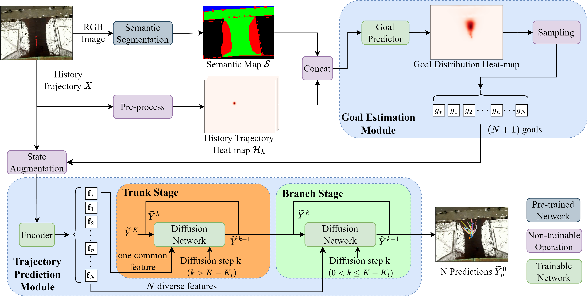

<h2 align="center">GDTS: Goal-Guided Diffusion Model with Tree Sampling for Multi-Modal Pedestrian Trajectory Prediction</h2>
<div align='center'>
  <br>Ge Sun, Sheng Wang, Lei Zhu, Ming Liu and Jun Ma*.
  <br>HKUST, HKUST(GZ)
  <br>IROS 2025 
</div>
</p>

<p align="center">
<a href='https://arxiv.org/pdf/2311.14922.pdf' style='padding-left: 0.5rem;'>
    
</a>
</p>


## Abstract
Accurate prediction of pedestrian trajectories is crucial for improving the safety of autonomous driving. However, this task is generally nontrivial due to the inherent stochasticity of human motion, which naturally requires the predictor to generate multi-modal prediction. Previous works leverage various generative methods, such as GAN and VAE, for pedestrian trajectory prediction. Nevertheless, these methods may suffer from mode collapse and relatively low-quality results. The denoising diffusion probabilistic model (DDPM) has recently been applied to trajectory prediction due to its simple training process and powerful reconstruction ability. However, current diffusion-based methods do not fully utilize input information and usually require many denoising iterations that lead to a long inference time or an additional network for initialization. To address these challenges and facilitate the use of diffusion models in multi-modal trajectory prediction, we propose GDTS, a novel Goal-Guided Diffusion Model with Tree Sampling for multi-modal trajectory prediction. Considering the "goal-driven" characteristics of human motion, GDTS leverages goal estimation to guide the generation of the diffusion network. A two-stage tree sampling algorithm is presented, which leverages common features to reduce the inference time and improve accuracy for multi-modal prediction. Experimental results demonstrate that our proposed framework achieves comparable state-of-the-art performance with real-time inference speed in public datasets.
<div align='center'>
  <br>
</div>

## Experiments
### Setup
All models were trained and tested on Ubuntu 22.04 with Python 3.9.6 and PyTorch 1.13.1 with CUDA 11.7.
Dataset can be downloaded with: (Provided by Goal-SAR)
```
$ source ./download_data.sh
```

### Train/Test
our GDTS model can be trained and tested with the following scripts:
```
source ./train.sh

source ./test.sh
```

## Acknowledgement

Part of the code is borrowed from [Goal-SAR](https://github.com/luigifilippochiara/Goal-SAR) and [MID](https://github.com/Gutianpei/MID). We thank the authors for releasing their code.

## Citation
If you find this code useful for your research, please cite our paper:

```bibtex
@inproceedings{sun2025gdts,
    title={\uppercase{GDTS}: Goal-Guided Diffusion Model with Tree Sampling for Multi-Modal Pedestrian Trajectory Prediction},
    author={Sun, Ge and Wang, Sheng and Zhu, Lei and Liu, Ming and Ma, Jun},
    booktitle={2025 IEEE/RSJ International Conference on Intelligent Robots and Systems (IROS)},
    pages={14595--14602},
    year={2025},
    organization={IEEE}
}
